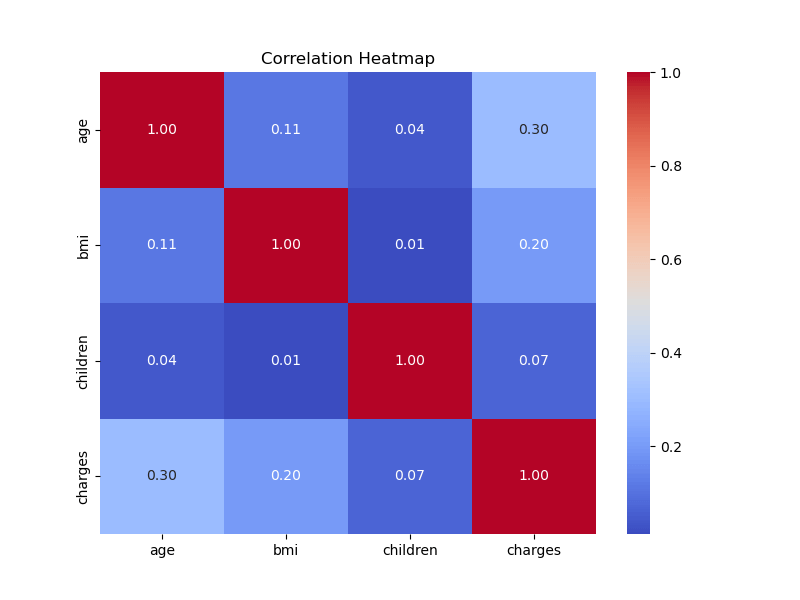
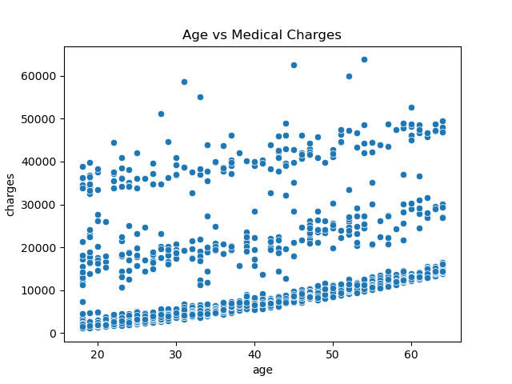
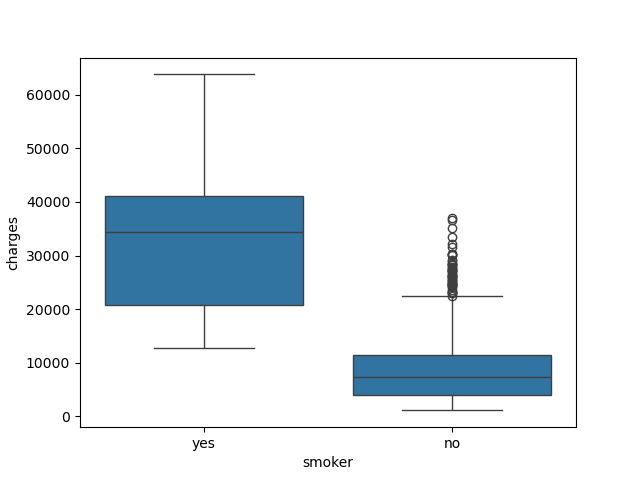
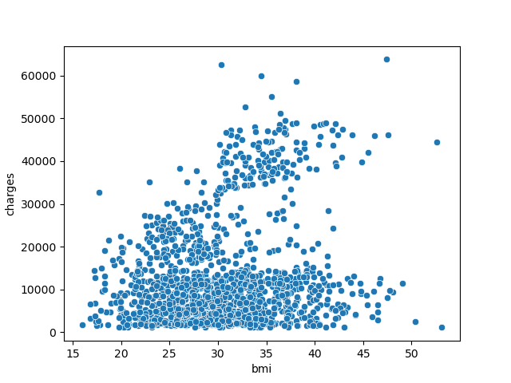
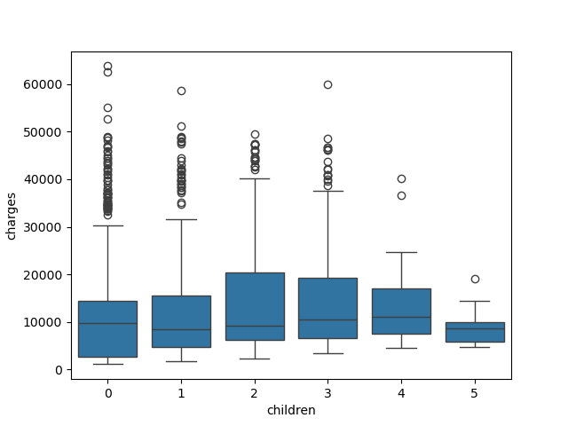
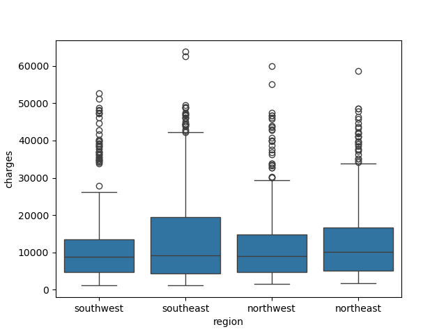
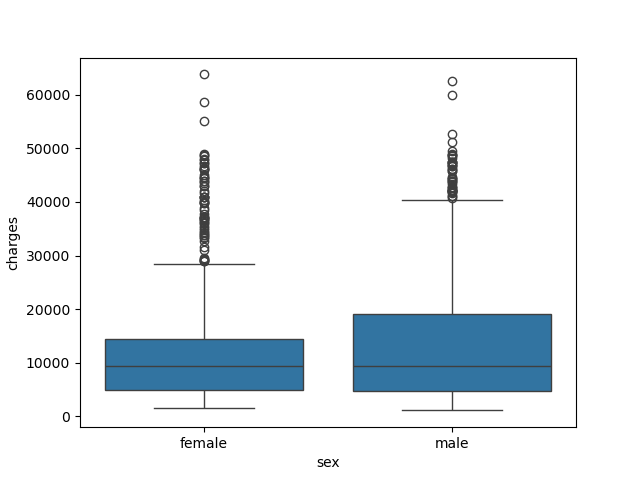

# Healthcare-Insurance-Cost-Analysis-
#### Healthcare Insurance Exploratory Data Analysis (EDA) project using Python, Pandas, Matplotlib, and Seaborn to analyze medical insurance charges and identify the major factors affecting healthcare costs.
## Project Overview
#### This project focuses on performing Exploratory Data Analysis on a healthcare insurance dataset to understand how demographic and lifestyle factors influence medical insurance charges.
### The analysis explores relationships between variables such as:
#### •	Age  •	BMI  •	Smoking status  •	Number of children  •	Gender  •	Region 
**The project aims to discover hidden patterns, trends, and risk factors that contribute to higher healthcare expenses using statistical analysis and data visualization techniques.**
## Objectives
#### • Understand the structure and characteristics of the dataset
#### • Perform data cleaning and preprocessing
#### • Analyze individual feature distributions
#### • Identify relationships between variables
#### • Discover major factors affecting insurance charges
#### • Generate business insights and recommendations
## Project Structure

```
Healthcare_Insurance_EDA/
│
├── Data/
│   └── insurance.csv
│
├── Notebook/
│   └── HealthcareCosts.ipynb
│
├── Report/
│   └── Healthcare_EDA_Presentation.pptx
│
├── Visualization/
│   ├── age_distribution.png
│   ├── bmi_analysis.png
│   ├── smoker_vs_charges.png
│   ├── correlation_heatmap.png
│   └── demo.gif
│
└── README.md
```
## Dataset Features
#### • age        : Age of the individual
#### • sex        : Gender of the individual
#### • bmi        : Body Mass Index
#### • children	  : Number of dependents
#### • smoker     : Smoking status
#### • region     : Residential region
#### • charges	  : Medical insurance charges
## Data Cleaning & Preprocessing
**The following preprocessing steps were performed:**
#### • Checked missing values
#### • Verified duplicate records
#### • Inspected data types
#### • Generated statistical summaries
#### • Verified categorical and numerical features
## Project Demo

## 📊 Project Presentation

**Click below to view the complete PowerPoint presentation:**

[](https://docs.google.com/presentation/d/1U9KGLoHc4Ca0LBWznONAah1UzxWCtgiJ/preview?usp=drive_link&ouid=113945714819178391756&rtpof=true&sd=true)
# Exploratory Data Analysis
## Univariate Analysis 
#### • Numerical features like age and BMI are fairly well spread, while charges show a strong right skew with few high-cost cases.
#### • Categorical features such as sex and region are balanced, but smoker status is highly imbalanced, which is likely to be a key factor influencing insurance costs.
## Bivariate Analysis 
#### The bivariate analysis shows clear relationships between variables and insurance charges. Smoking status has the strongest impact, where smokers pay significantly higher insurance charges than non-smokers. Age and BMI also show a positive relationship with charges, meaning costs increase with both factors. However, the number of children and gender have a weak or minimal effect on insurance charges. Overall, smoking, age, and BMI are the key influencing factors.
## Multivariate Analysis 
#### The multivariate analysis shows that insurance charges are influenced by a combination of factors rather than a single variable. Smokers consistently show the highest charges across all age and BMI groups. Individuals who are older and have higher BMI tend to pay more, especially when smoking is also present. Age and BMI alone have moderate impact, but smoking significantly amplifies the effect on charges. Overall, smoking is the most dominant factor driving high insurance costs when combined with other variables.
## Hypothesis Conclusions
### H1: Age increases healthcare charges
#### The analysis shows a mild to moderate positive relationship between age and medical charges. As age increases, healthcare costs tend to rise, likely due to higher medical needs in older individuals. However, the relationship is not extremely strong, suggesting other factors also play a major role.
### Hypothesis Testing

### H2: Smokers have significantly higher charges
#### The analysis shows a strong and clear difference between smokers and non-smokers. Smokers incur significantly higher medical charges, indicating a strong association between smoking behavior and increased healthcare costs.
### Hypothesis Testing

### H3: Higher BMI leads to higher healthcare expenses
#### The analysis indicates a positive relationship between BMI and medical charges. Individuals with higher BMI tend to have increased healthcare costs, likely due to obesity-related health conditions.

## H4: Number of children increases charges slightly
#### The analysis shows a weak relationship between number of children and medical charges. While slight variations exist, there is no strong or consistent upward trend.

## H5: Region affects healthcare charges
#### The analysis indicates that region has a minimal effect on medical charges. Differences between regions are small and not significant enough to suggest a strong relationship.

## H6 : Gender may have minor or no strong effect
#### The analysis shows that gender has minimal impact on healthcare charges. Both males and females exhibit similar cost distributions, indicating gender is not a strong predictor of insurance charges.

## Key Insights
#### • Smoking status has the strongest impact on insurance charges.
#### • Smokers pay significantly higher medical costs than non-smokers.
#### • Insurance charges generally increase with age and BMI.
#### • The number of children has a weak influence on medical expenses.
#### • Individuals who are older, have higher BMI, and smoke tend to show the highest insurance charges.
#### • Healthcare expenses are influenced by multiple interacting factors rather than a single variable.
## Business Insights
#### • Smokers represent a high-risk customer segment for insurance companies.
#### • Higher BMI and increasing age are associated with increased healthcare expenses.
#### • Insurance companies can design personalized premium plans using customer risk profiles.
#### • Preventive healthcare programs may help reduce long-term medical costs and claim amounts.
#### • Identifying high-risk individuals early can improve risk management strategies.
## Recommendations
#### • Promote healthy lifestyle awareness among customers.
#### • Encourage smoking cessation and wellness programs.
#### • Introduce personalized insurance premium structures based on risk factors.
#### • Conduct preventive healthcare and regular health checkup campaigns.
#### • Use data-driven approaches for customer risk assessment and healthcare planning.
## Conclusion
####  This project successfully explored the healthcare insurance dataset using Exploratory Data Analysis techniques. The analysis identified smoking, age, and BMI as the major factors influencing insurance charges. The study demonstrates how data analysis can help insurance companies understand customer risk behavior and make better business decisions.
## Technologies Used
#### • Python     • Pandas    • NumPy     • Matplotlib    • Seaborn    • Jupyter Notebook
#### Author
#### Kavita Bisht
### LinkedIn:  www.linkedin.com/in/kavita-bisht-17345b3a6


