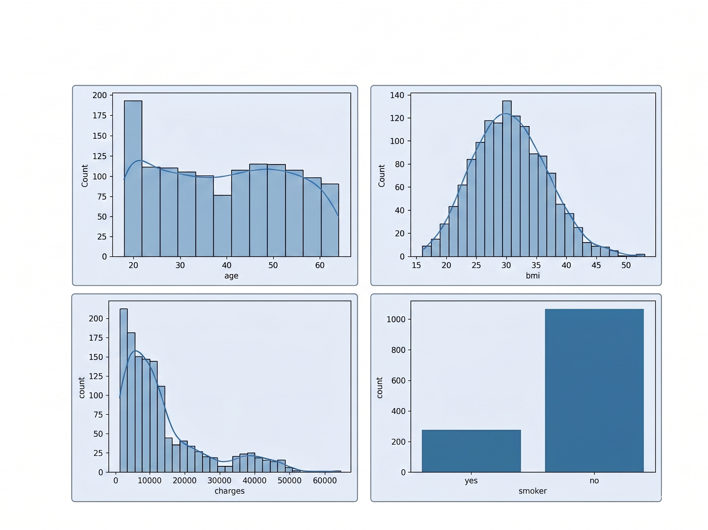

# Healthcare-Insurance-Cost-Analysis-
Healthcare Insurance Exploratory Data Analysis (EDA) project using Python, Pandas, Matplotlib, and Seaborn to analyze medical insurance charges and identify the major factors affecting healthcare costs.
## Project Overview
This project focuses on performing Exploratory Data Analysis on a healthcare insurance dataset to understand how demographic and lifestyle factors influence medical insurance charges.
The analysis explores relationships between variables such as:
#### •	Age  •	BMI  •	Smoking status  •	Number of children  •	Gender  •	Region 
**The project aims to discover hidden patterns, trends, and risk factors that contribute to higher healthcare expenses using statistical analysis and data visualization techniques.**
## Problem Statement
### Healthcare costs vary significantly among individuals.

**This project aims to identify the key factors that influence insurance charges and understand their relationship with medical expenses.**
## Objectives
#### • Understand the structure and characteristics of the dataset
#### • Perform data cleaning and preprocessing
#### • Analyze individual feature distributions
#### • Identify relationships between variables
#### • Discover major factors affecting insurance charges
#### • Generate business insights and recommendations
## Project Structure

```
Healthcare_Insurance_EDA/
│
├── Data/
│   └── insurance.csv
│
├── Notebook/
│   └── HealthcareCosts.ipynb
│
├── Report/
│   └── Healthcare_EDA_Presentation.pptx
│
├── Visualization/
│   ├── age_distribution.png
│   ├── bmi_analysis.png
│   ├── smoker_vs_charges.png
│   ├── correlation_heatmap.png
│   └── demo.gif
│
└── README.md
```
## Dataset Features
#### • age        : Age of the individual
#### • sex        : Gender of the individual
#### • bmi        : Body Mass Index
#### • children	  : Number of dependents
#### • smoker     : Smoking status
#### • region     : Residential region
#### • charges	  : Medical insurance charges
## Data Cleaning & Preprocessing
**The following preprocessing steps were performed:**
#### • Checked missing values
#### • Verified duplicate records
#### • Inspected data types
#### • Generated statistical summaries
#### • Verified categorical and numerical features
## Project Demo

# Exploratory Data Analysis
## Univariate Analysis 




